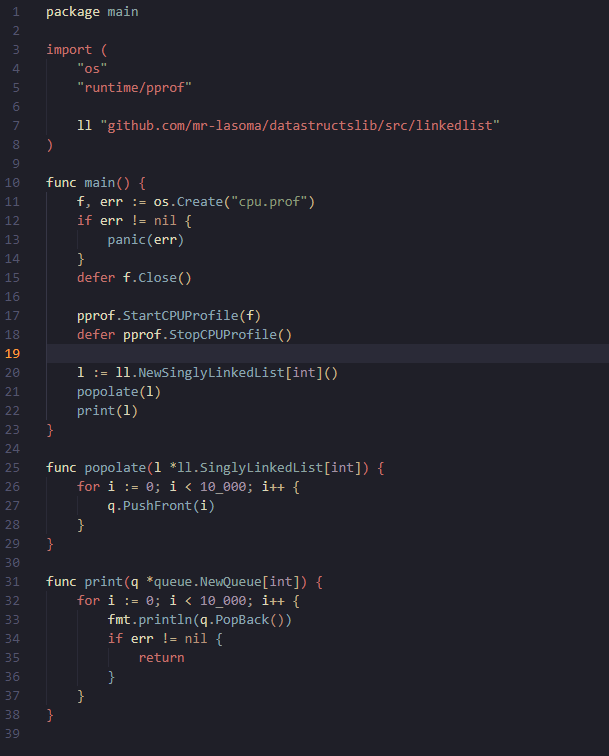

# Data Structures Library

A lightweight library implementing common data structures in **Go**. I created this project to deepen my understanding of data structures and practice implementing them from scratch.

## Installation

```bash
go get github.com/mr-lasoma/datastructslib
```

## Features

* Hashmaps
* Queues
* LinkedLists

# HashMap test


# Queue test


# LinkedList test

